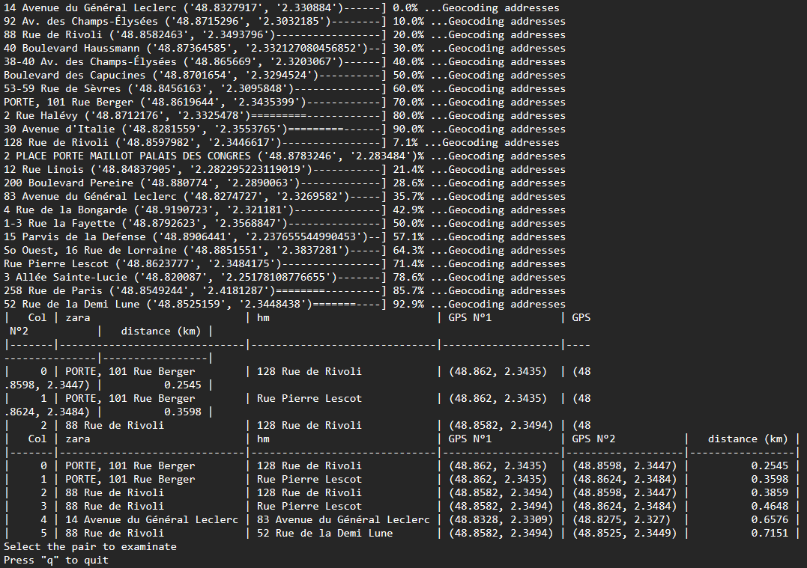
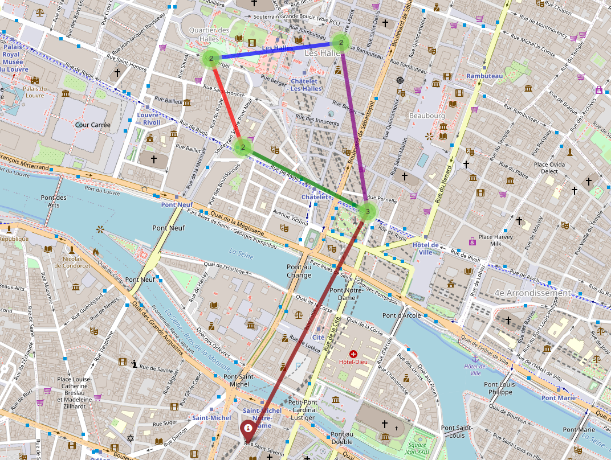

# GeoIntLocalisator
 Simple scrapping tool in Python 3 using selenium to find quickly the distance between two generic locations (supermarket, store...)
 Typically used for GeoInt on a picture with two stores visually detectables.
 Since it doesn't use an API, the execution time is pretty slow as Nominatim impose a 1s delay between each query.

# Features 
-	Display a list of locations pairs with minimum distance each
-	Can show them on a local map
-	Save them to text

# Use
-q/--query => Google map queries 
	Ex: -q town store1!town store2 additional_query_info
If you want to know if your query is correct, check it on google maps before and see if you obtain desired result

-s/--scope => Filter results above specified distance in a locations pair (km) 
	Ex: -s 0.5
-o/--output => Export to text file 
	Ex: -o address.txt

-M/--map => Show location of targets by pair on a map (saved locally)

-A/--AInfos => Gives you the whole addresses with reverse-geocoding (slower), use "full"
	for all addresses, and "selection" to get only the addresses you will selected
	We don't recommend using the full option if you expect a lot of results.
	Ex : -A selection

To select an item in result screens :

1-4 => select elements from 1 to 4
1,4 => select element 1 and 4

# Map example 

# Install with pip
pip install -r "requirements.txt"

Driver is in the repository but here is the official link with the mozilla version :
https://github.com/mozilla/geckodriver/releases
