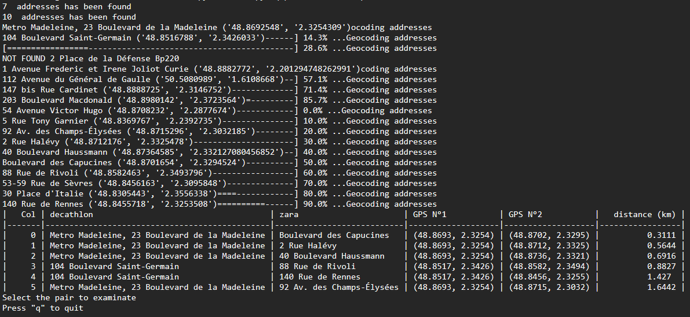
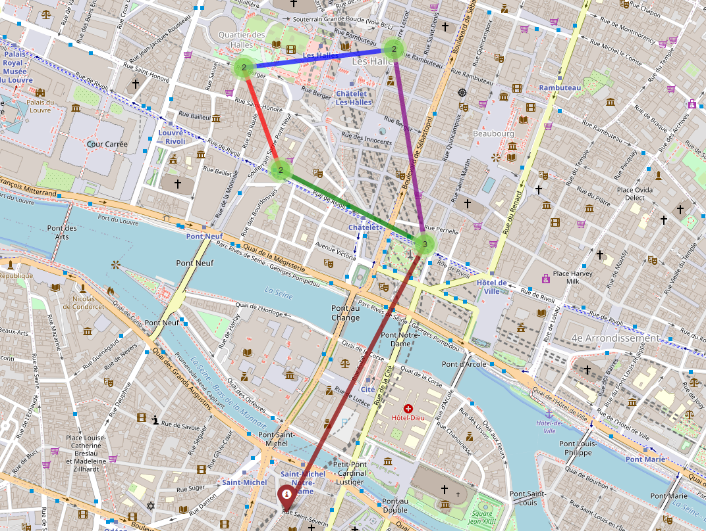

# GeoIntLocalisator
 Simple scrapping tool in Python 3 using selenium to find quickly the distance between two unknown generic locations (supermarket, store...)

 Typically used for GeoInt on a picture where you can recognize two generic element in the background (ie a park and a store).
 This tool does not use an API key.

# Features 
-	Display a list of locations pairs with minimum distance each
-	Can show them on a local map
-	Save them to text

# Use
-q/--query => Google map queries 
Ex: -q town store1!town store2 additional_query_info
If you want to know if your query is correct, check it on google maps before and see if you obtain desired result.
It is for instance

-s/--scope => Filter results above specified distance in a locations pair (km). Default value is 0.75.
Ex: -s 0.5

-o/--output => Export to text file 
Ex: -o address.txt

-M/--map => Create map and show location of targets by pair on a local map.

-A/--AInfos => Gives you the whole addresses with reverse-geocoding (slower), use "full"
	for all addresses, and "selection" to get only the addresses you will selected
	We don't recommend using the full option if you expect a lot of results.
Ex : -A selection
Bug : In some cases, the reverse geocoding can lead to false results being displayed on the map. This is due to a geopy data error.

-S/--Select => Select automatically the first n results. This is especially useful if you want to automate the script.

# Examples :
Result screen :

0 => select element 0 
1-4 => select elements from 1 to 4 
1,4 => select element 1 and 4 

Map :

# Install with pip
pip install -r "requirements.txt"

Driver is in the repository but here is the official link with the mozilla version :
https://github.com/mozilla/geckodriver/releases
